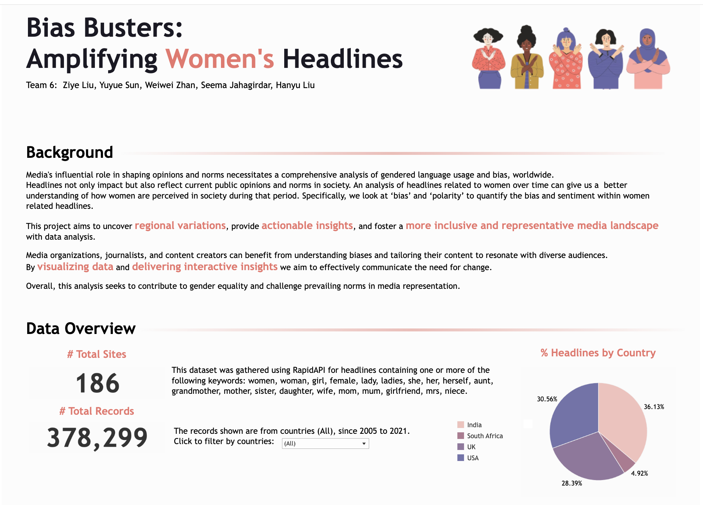

# Bias Busters: Amplifying Women's Headlines
## Sentiment Analysis in Headlines
This project employs exploratory data analysis and natural language processing (NLP) techniques to identify sentiment within news headlines, with a particular focus on gender biases and editorial sensationalism.headlines.

## Bias Detection
Two key metrics for detecting biases:

Bias Score: To quantify gender biases, we curated two specialized dictionaries. The first contains words specifically related to women, and the second includes words that denote societal and behavioral stereotypes about women. A headline's bias score is derived from the number of words that overlap with these dictionaries.

Polarity Score: Sensationalism in editorial content often manifests through the use of provocative language designed to attract readers' attention. Using sentiment analysis, we assign each headline a polarity score that indicates its level of sensationalism. This is achieved through vaderSentiment, a tool that evaluates the emotional tone of the text. Headlines with highly positive or negative sentiments are deemed sensational and receive a higher polarity score.

## Model Implementation
To classify headlines as biased or unbiased, we use two modeling approaches:

Logistic Regression: Chosen for its simplicity and interpretability, logistic regression serves as a robust baseline for text classification tasks.

Multi-Layer Perceptron (MLP): This neural network architecture is adept at capturing complex patterns and dependencies within the text data, which is crucial for identifying subtler forms of bias.

## Key takeaways
- Sensationalism is notably more prevalent in headlines featuring keywords related to women, compared to those covering different subjects.
- Identifying Gender Bias in a wider range using our ML model. 

For a more detailed analysis and findings, please refer to our comprehensive and interactive Tableau dashboards (**click on the pic below**)
